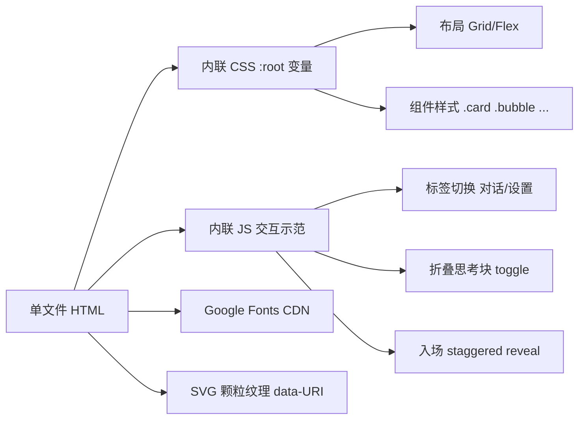

# 技术架构文档 · 杏铃聊天设计画布重设计

## 1. 总体架构

### 1.1 架构图



### 1.2 技术选型

| 维度 | 选型 | 理由 |
|---|---|---|
| 框架 | 原生 HTML + CSS + JS | 单文件可下载直链，无构建步骤 |
| 字体 | Google Fonts CDN | 仅 Fraunces / Manrope / JetBrains Mono 三族 |
| 图标 | 内联 SVG | 避免 Material Icons 字体依赖 |
| 纹理 | SVG `feTurbulence` data-URI | 纸质颗粒感，无图片请求 |
| 动画 | 纯 CSS + 极少 JS | 首屏快、易维护 |

## 2. 文件结构

```
design/
  preview.html      # 唯一文件（重写）
.trae/documents/
  PRD.md
  tech-architecture.md
```

## 3. 模块划分（HTML 内部分区）

### 3.1 顶层结构

```html
<!doctype html>
<html lang="zh-CN">
<head> ... <style> ... </style></head>
<body>
  <div class="grain"></div>           <!-- 颗粒纹理覆盖层 -->
  <div class="watermark">杏</div>     <!-- 签名水印 -->
  <main class="app">
    <aside class="sidebar">...</aside>
    <section class="main">
      <header class="topbar">...</header>
      <div class="content" id="view-chat">...</div>
      <div class="content hidden" id="view-settings">...</div>
      <footer class="composer">...</footer>
    </section>
  </main>
  <script>...</script>
</body>
</html>
```

### 3.2 CSS 变量区

集中定义在 `:root`，按用途分组：
- 背景 ink 系列
- 文字 paper 系列
- 强调 apricot / saffron / moss / clay
- 边框 border / border-strong
- 字体族 font-d / font-b / font-m
- 圆角 radius / radius-sm
- 阴影 shadow-soft / shadow-glow

### 3.3 组件清单

| 组件 | 类名 | 说明 |
|---|---|---|
| 品牌区 | `.brand` | 含「杏」字标 + 名称 + 英文小字 |
| 新对话按钮 | `.btn-new` | 描边 + 杏色描边 hover |
| 搜索框 | `.search` | 内嵌搜索图标 |
| 会话项 | `.conv-item` / `.conv-item.active` | 含活跃指示点 |
| 导航 | `.nav-foot` / `.nav-tile` | 底部 2 入口 |
| 顶栏 | `.topbar` | 标题 + 模型徽标 + 流式脉冲 |
| 消息列表 | `.msg-list` | 容器 |
| 消息气泡 | `.bubble.user` / `.bubble.ai` | 区分角色 |
| 头像 | `.avatar.user` / `.avatar.ai` | 30px 圆角方块 |
| 思考块 | `.reasoning` / `.reasoning.open` | 可折叠 |
| 来源块 | `.sources` | 含编号 + host |
| 附件块 | `.attachments` | 横向 chip |
| 操作行 | `.actions` | 复制/重试 |
| 流式光标 | `.caret` | 闪烁动画 |
| 输入框 | `.composer-input` | 自适应高度 |
| 工具按钮 | `.tool-btn` / `.tool-btn.active` | 附件/联网/语音 |
| Token 计数 | `.token-counter` | 等宽 + 颜色阈值 |
| 发送按钮 | `.send-btn` / `.send-btn.stop` | 渐变/停止态 |
| 服务商网格 | `.service-grid` / `.service-card` | 4 列 |
| 字段 | `.field` | 标签 + 输入 |
| 滑块行 | `.slider-row` | 横向布局 |
| 开关行 | `.toggle-row` | 含图标 |
| 导航行 | `.nav-row` | 含箭头 |
| 保存条 | `.save-bar` | 取消/保存 |
| 颗粒层 | `.grain` | fixed 全屏覆盖 |
| 水印 | `.watermark` | 巨大「杏」字 |

## 4. 关键样式实现

### 4.1 颗粒纹理

```css
.grain{
  position:fixed; inset:0; pointer-events:none; z-index:100;
  opacity:.04; mix-blend-mode:overlay;
  background-image:url("data:image/svg+xml,%3Csvg ... feTurbulence ...%3E");
}
```

### 4.2 杏字水印

```css
.watermark{
  position:fixed; top:-4vh; right:-2vw; z-index:0;
  font-family:var(--font-d);
  font-size:62vh; font-weight:900;
  color:var(--apricot); opacity:.04;
  pointer-events:none; user-select:none;
  line-height:1;
}
```

### 4.3 入场 staggered

```css
@keyframes riseIn{
  from{opacity:0; transform:translateY(8px)}
  to{opacity:1; transform:none}
}
.rise{ animation:riseIn .6s cubic-bezier(.2,.7,.2,1) both; }
.rise:nth-child(1){animation-delay:.05s}
.rise:nth-child(2){animation-delay:.10s}
/* ... */
```

### 4.4 流式脉冲

```css
@keyframes pulse{
  0%,100%{opacity:1; transform:scale(1)}
  50%{opacity:.35; transform:scale(.85)}
}
.dot-pulse{ animation:pulse 1.6s ease-in-out infinite; }
```

## 5. 交互（极简）

仅 3 个 JS 交互：
1. 底部导航「对话/设置」切换显示
2. 思考块点击折叠/展开
3. 服务商卡片点击切换选中

不做真实数据流，仅视觉示范。

## 6. 性能预算

| 指标 | 目标 | 验证方式 |
|---|---|---|
| 文件体积 | < 80KB | `wc -c design/preview.html` |
| 外部请求 | ≤ 2 | Google Fonts CSS + 字体文件 |
| 首屏渲染 | < 1s | 浏览器 Performance 面板 |
| 动画帧率 | ≥ 50fps | 仅 transform/opacity 动画 |

## 7. 兼容性兜底

- `font-family` 链最后回退 `system-ui, sans-serif`
- SVG `feTurbulence` 不支持时纹理静默丢失，不影响主功能
- `aspect-ratio` 不支持时用 `padding-top` hack

## 8. 验证清单

- [ ] `wc -c design/preview.html` < 81920
- [ ] 移动端 Safari 打开无横向滚动
- [ ] 三段式布局可读
- [ ] 至少 8 个组件视觉示范齐全
- [ ] 杏字水印可见但不喧宾夺主
- [ ] 颗粒纹理在浅色元素上轻微可见
- [ ] 颜色无紫色出现
